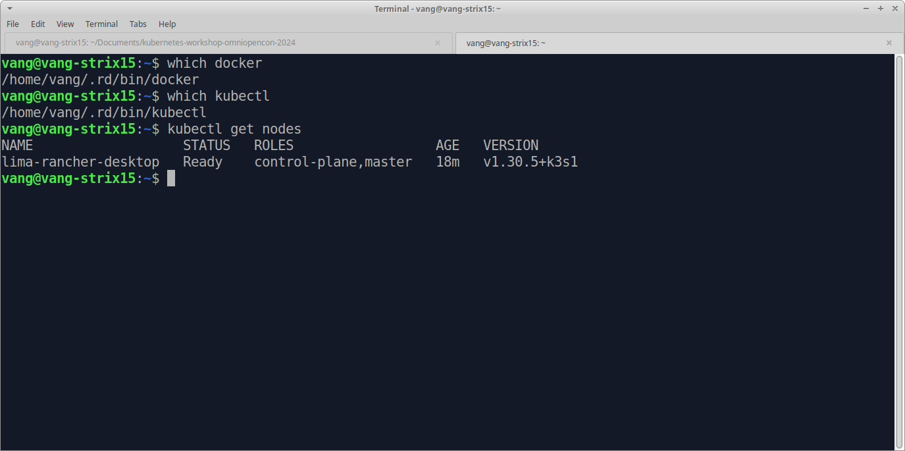
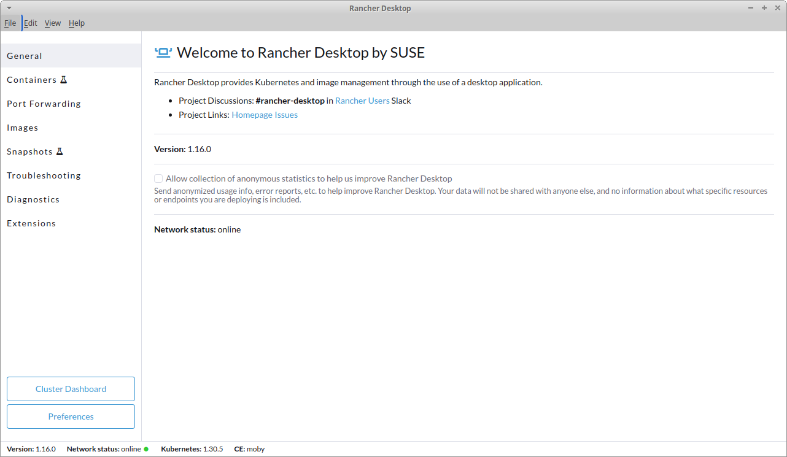
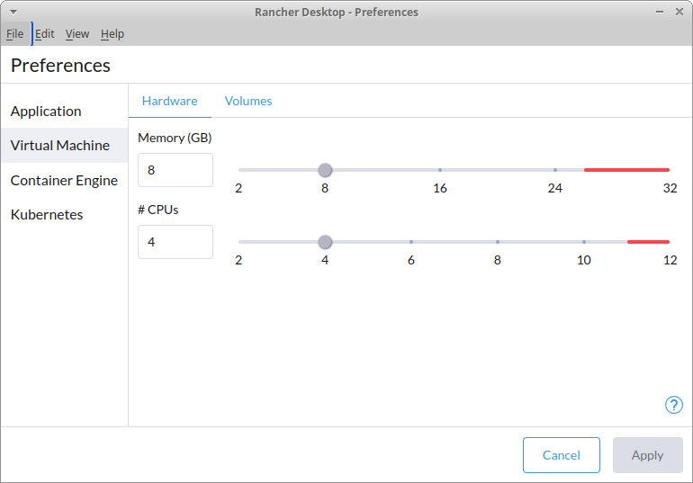

# Kubernetes workshop OmniOpenCon 2024

# How to install stuff in Kubernetes

kubernetes workshop @ https://omniopencon.org

2024-09-25 Viorel Anghel

## Necesar

1. Puteti urmari cum lucrez eu sau puteti incerca unele exemple in paralel cu mine. Tot ce este necesar se va regasi in acest repo: https://github.com/viorel-anghel/kubernetes-workshop-omniopencon-2024
2. Voi folosi un laptop cu Linux (XUbuntu) pe care am deja instalat Rancher Desktop: https://rancherdesktop.io/
Acesta este software free si open-source care permite sa rulati un Kubernetes local si access la comenzile `docker` si `kubectl`. Rancher Desktop este disponibil pentru toate sistemele de operare uzuale.
3. Daca aveti alte optiuni de a rula Kubernetes si Docker local pe laptopul vostru, este ok in principiu, tot ce lucram impreuna ar trebui sa functioneze (ne-testat totusi). De exemplu ati putea avea deja instalate Docker Desktop sau minikube, caz in care puteti alege sa nu instalati Rancher Desktop.
4. Pe scurt, daca puteti rula pe laptopul vostru, in linia de comanda `docker ps` si `kubectl get nodes` suntem all good.







## WHY?

De ce este Kubernetes atat de popular in industrie? Cum s-a ajuns la el? La ce ajuta?

- 2005-2011 Microservices - https://en.wikipedia.org/wiki/Microservices
- 2013 Docker containers
- 2014 Kubernetes - containers on multiple VMs

## Containers versus VMs

Pros and cons

## Why Kubernetes and not...

- Docker Swarm - too little, too late
- 2014 - 2018 - other players
- 2018 - all major cloud providers adopt Kubernetes

## Avantajele comunitatii

- free and open source
- condus de o fundatie non-profit - Cloud Native Computing Foundation - 2015 - Kubernetes 1.0
- probabil cel mai mare proiect open source dupa Linux Kernel
- popularitate in crestere exponentiala

## Avantaje tehnice

- High Availability - la nivel de control-plane si la nivel de workers
- Scalability - adding nodes to cluster
	- Autoscaling - VPA, HPA, cluster auto-scaling
- It works almost the same in cloud and on-premmise
	- the great eqaulzer! cloud migrations made easy
- Easy to run everywhere (like Docker!) - from laptop to 1 VM to 100 servers

## Cum se acceseaza un cluster de Kubernetes
- asa cum Docker are comanda de baza `docker`, Kubernetes are comanda `kubectl`
- acesta este de fapt un simplu client care se conecteaza la Kubernetes api-server
	- in consecinta au aparut sialte interfete (grafice sau text-mode sau chiar cod)
- se bazeaza pe un fisier de configurare 
	- default location `~/.kube/config`
	- evironment variable KUBECONFIG=~/.kube/my-second-cluster
	- in config sunt definite URL api-server si certificate SSL pentru autentificare/autorizare

## Sa incercam primele comenzi kubectl

```
kubectl get nodes
kubectl get nodes -o wide
kubectl describe node XYX

kubectl get namespaces

kubectl get pods

kubectl -n kube-system get pods

kubectl run --image=nginx my-nginx
```

De discutat:

- namespace default
- namespaced versus cluster-wide objects
- de unde se ia acea imagine `nginx`?

## Forma normala a comenzilor kubectl

`kubectl [-n namespace] VERB OBJECT_TYPE ONJECT_NAME [ -o wide ]`

- VERB: get describe delete create|run
- OBJECVT_TYPES (pana acum): node namespace pod

## Imperative vs declarative

Pentru ca obiectele astea pot sa aibe tone de parametri, comenzile imperative de creare sunt rar folosite
si este preferata forma declarativa, in care se scrie un fisier in format YAML care descrie obiectl de creat. de exemplu, urmatoarele variante creeaza de fapt acelasi obiect:

```
kubectl create namespace demo-ns

kubectl apply -f demo-ns.yaml
```

Un exemplu de YAML *manifest* pentru crearea unui pod cu nginx dar in namespace-ul demo-ns: simple-pod.yaml 

Structura din fisierul `simple-pod.yaml` este similara pentru toate obiectele din Kubernetes: 
- `apiVersion`, 
- `kind` - tipul obiectului, 
- `metadata` (cu `name` obligatoriu si frecvent `namespace`), 
- `spec` cu specificatiile obiectului, aici formatul exact difera in functie de tipul obiectului

Puteti inclusiv obtine respectivul yaml pentru un obiect existent:
```
kubectl get pod nginx -o yaml
```

## Cum sa rulam codul nostru

Va trebui sa ne intoarcem putin la Docker, mai exact la `docker build`. 
Tot ce se ruleaza in Kubernetes este pe baza de containere sau mai exact pe imagini de container.

Ca si la Docker, este important sa avem un long running process si cel mai simplu exemplu la care ma pot gandi
este un server de web care asculta pe portul 8080 si afiseaza o pagina simpla statica.

Putem avea si cod care ruleaza si se termina. La Docker acel container va rula si isi va termina ciclul de viata
cand procesul principal se termina. La Kubernetes, pentru asta, exista un obiect dedicat numit `Job`.

Dar sa revenim la exemplul simplu. O sa creez o imagine de container, pornind de la Ubuntu peste care instalez un nginx si apoi pagina de afisat. 

In directorul `docker-image`:
- `less Dockerfile`
- `docker build -t mysite:v0.2 .`
- `docker run -d --name mysite mysite:v0.2`

## Unde este imaginea asta?

Deocamdata local, pe al meu laptop. Daca dorim putem folosi un image repository remote dar pentru acest workshop
am incercat sa pastrez lucrurile simple. Din fericire, Rancher Desktop are un mecanism prin care poate accesa
aceste imagini locale asa ca pentru a o rula in Kubernetes nu am nevoie de nimic special!

## Decat de un yaml file, desigur!

In acelasi director `docker-image`, less `mysite.yaml` observam:
- namespace este singurul obiect care nu are `spec`
- in acelasi fisier yaml pot defini mai multe obiecte
- mai multe obiecte pot avea acelasi nume daca au tip diferit
 
Sa aplicam si sa verificam:

```
kubectl apply -f mysite.yaml 

kubectl get pods
# ???

kubectl -n mysite get pods
```

## Ok, este running. Cum accesam mysite port 8080?

- Fiecare pod are o adresa de IP (o sa vorbim si de mecanisme mai elegante, cu nume in DNS dar deocamdata folosim IP)
- In Kubernetes exista o retea INTERNA, in care pot comunica intre ele pod-urile si nodurile, pe IP-uri "interne"
- In acest moment, cel mai simplu ar fi sa rulam un alt pod si sa accesam de pe el pod-ul nostru cu mysite

```
# get the internal pod ip
kubectl -n mysite get pods -o wide

# run a new pod
kubectl run tmp-shell --restart=Never --rm -it --image ubuntu -- /bin/bash
	apt update
	apt install curl
	curl 10.42.0.22:8080
	exit

# pretty ugly, thuis is why I have an image I use for debuging:
kubectl run dummy --image=vvang/dummy:amd64
[...]
kubectl exec -ti dummy -- bash
	curl 10.42.0.22:8080
```

## De ce tot vorbim despre pod si nu containere?
- in Kubernetes, Pod-ul este workload-ul atomic
- Un pod este compus din unul sau mai multe containere, fiecare cu imaginea lui
- Un pod poate avea zero sau mai multe volume de date
- Un pod are adresa de IP

## Multi-container pods
- este un caz mai degraba rar si trebuie folosit cand este nevoie
- containerele au acelasi network (shared localhost) dar nu si acelasi filesystem!
- pentru scalare orizontala se folosesc mai multe pod-uri (NU mai multe containere identice ina celasi pod!)

## Deployments versus Pods

Pe langa Pod, in Kubernetes exista si alte obiecte de tip workload, adica cele care ruleaza cod si se bazeaza pe imagini de container. Primul si cel mai folosit se numeste Deployment.

Un Deployment
- are in definite un pod template
- creeaza un numar de poduri identice, numarul fiind specificat de parametrul `replicas`
- poate scala up si down numarul de poduri
- are mecanisme HA de modificare a pod-urilor, de exemplu versiunea de imagine folosita ("rollout")

Am creat un nou director pentru asta: `deployment`:

```
# cleanup mysite
kubectl delete -f mysite.yaml
cd ../deployment

# sa vedem cum arata un deployment
less mysite-deploy.yaml 

kubectl apply -f mysite-deploy.yaml 
kubectl -n mysite get pods
```

Deci, in descrierea uunui deployment avem:
- `apiVersion` si `Kind` diferite!
- `replicas`
- `selector` 
- `template`	 
	- cu `metadata.labels` care se potrivesc cu `selector.matchLabels`
	- cu `template.spec` unde arata ca un pod normal

## Despre mecanismul label - selector
Intr-un cluster de Kubernetes pot rula potential mii de pod-uri si chiar daca exista namespaces, organizarea lor poate fi dificila. 

Kubernetes poate tag-ui pod-urile cu `labels` astfel incat sa stie ca toate pod-urile cu un anumit label fac parte dintr-un grup. 

Acest mecanism label-selector este folosit intern de Kubernetes (o sa vedem imediat, la services) 
dar poate fi folosit si in kubectl:

```
# arata pod-urile care au un anumit label
kubectl -n mysite get pods -l app=mysite
```

## Ok, avem Deployment, ce facem cu el?

```
kubectl -n mysite get deploy

kubectl -n mysite get replicaset

kubectl -n mysite get pods -o wide

# try deleting one pod
kubectl -n mysite delete pod mysite-77c797fd6-7qqh7  
kubectl -n mysite get pods

# restart all pods
kubectl -n mysite rollout restart deploy mysite
kubectl -n mysite get pods

# scale up or down
# edit mysite-deploy.yaml
# apply and verify
kubectl -n mysite get pods
```

## Changing the image version without downtime

Build a new version for our docker image, edit the mysite-deploy.yaml and re-apply. 

Check again: deployment, replicaset, pods.

## Time to discuss networking

Avem un deployment cu 2 sau 3 pod-uri identice si gata sa primeasca request-uri http. Dar cum trimitem trafic catre ele?
- fiecare pod are propriul IP
- la restart/upgrade, numele si IPul pod-urilor se schimba

 
